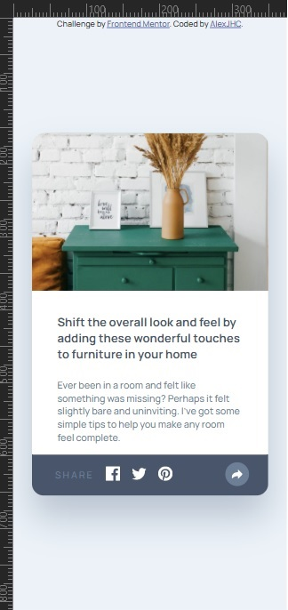
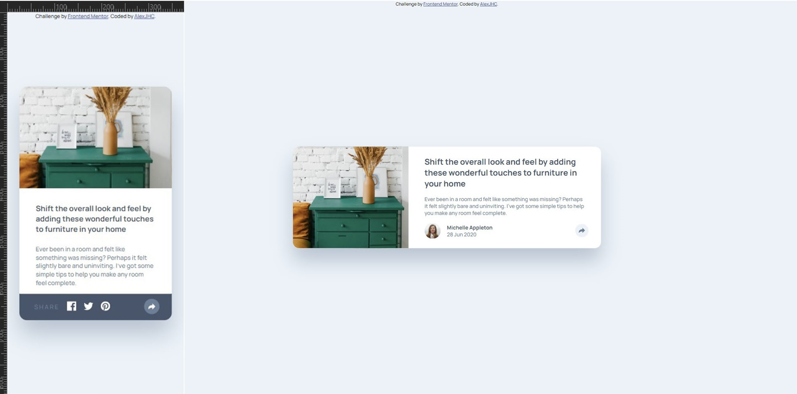

# Frontend Mentor - Article preview component solution

This is a solution to the [Article preview component challenge on Frontend Mentor](https://www.frontendmentor.io/challenges/article-preview-component-dYBN_pYFT).

## Table of contents

- [The challenge](#the-challenge)
- [Screenshot](#screenshot)
- [Links](#links)
- [Built with](#built-with)

### The challenge

Users should be able to:

- View the optimal layout for the component depending on their device's screen size
- See the social media share links when they click the share icon

### Screenshot

### Links

- Solution URL: [solution URL here](https://www.frontendmentor.io/solutions/html-css-js-0WIRfISPS)
- Live Site URL: [live site URL here](https://alexjhc.github.io/Frontendmentor/article-preview-component-master/index.html)

### Built with

- HTML5 markup
- CSS custom properties
- Mobile-friendly
