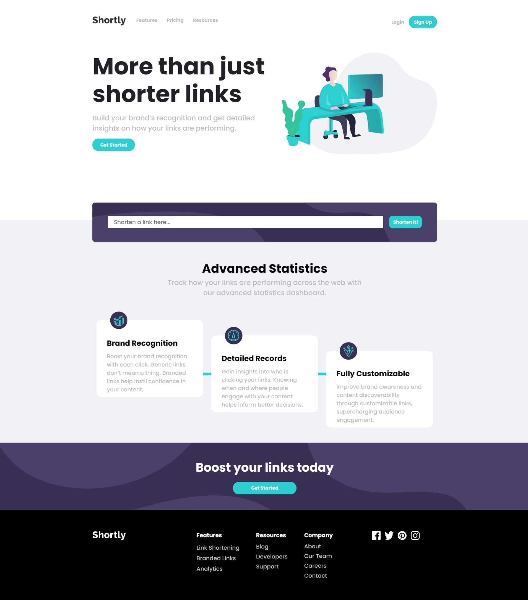

# Frontend Mentor - Shortly URL shortening API Challenge solution

## Table of contents

- [The challenge](#the-challenge)
- [Screenshot](#screenshot)
- [Links](#links)
- [My process](#my-process)
- [Built with](#built-with)
- [What I learned](#what-i-learned)

### The challenge

Users should be able to:

- View the optimal layout for the site depending on their device's screen size
- Shorten any valid URL
- See a list of their shortened links, even after refreshing the browser
- Copy the shortened link to their clipboard in a single click
- Receive an error message when the `form` is submitted if:
  - The `input` field is empty

### Screenshot




### Links

- Solution URL: [Solution URL](https://www.frontendmentor.io/challenges/url-shortening-api-landing-page-2ce3ob-G)
- Live Site URL: [Live site URL](https://alexjhc.github.io/Frontendmentor/url-shortening-api-master/index.html)

## My process

### Built with

- Semantic HTML5 markup
- CSS custom properties
- Flexbox
- Mobile-frendly
- [React](https://reactjs.org/) - JS library
- React npm:
  - CopyToClipboard
  - React-loading
  - React-router

### What I learned

React-router HashLinks

```js
<Link smooth to={"/page#Card"} onClick={toggle}>
  Pricing
</Link>
```

Async fetch data with loading and error catch

```js
async function getLink() {
    if (short.length > 9) {
      setShort([])
    } else { await fetch(`https://api.shrtco.de/v2/shorten?url=${link}`)
    .then(res => res.json())
    .then((data) => {
      short.push({short:data.result.short_link, long:data.result.original_link})
      setShort(short);
      setIsLoading(false)
    })
     .catch(() => {
       setMistake (true)
       setIsLoading(false)
      })
    }
   }
};
```
